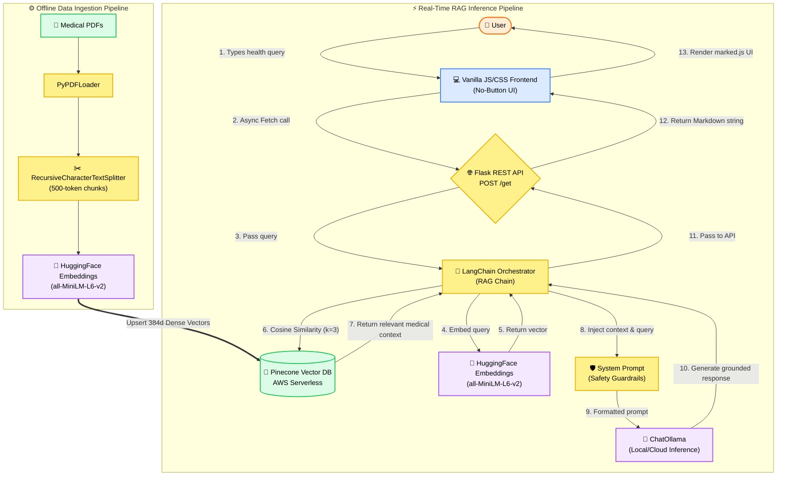

# WellnessAI: Evidence-Based Wellness Assistant

WellnessAI is a conversational generative AI assistant designed to provide safe, context-aware health and wellness guidance. 

As large language models (LLMs) are prone to hallucinations—which can be dangerous in a medical context—this project was built to constrain the AI's knowledge. By utilizing a **Retrieval-Augmented Generation (RAG)** architecture, the assistant anchors its responses strictly in verified medical literature, ensuring that the guidance it provides is both helpful and responsible.

## 🧠 Core Philosophy
This project was built with two primary goals:
1. **AI Safety First**: The assistant is engineered to defer to human professionals for diagnostics, strictly refusing to answer out-of-context queries, and relying only on injected context.
2. **Frictionless User Experience**: The frontend avoids bloated frameworks, utilizing a zero-dependency, vanilla stack to deliver a fast, system-aware, minimalist interface.

---

## 🏗 System Architecture

The application is split into two distinct pipelines: **Data Ingestion** (offline) and **Inference** (real-time).

### Comprehensive System Flow


### 1. Data Ingestion Pipeline (RAG Setup)
Before the assistant can answer questions, domain-specific medical documents are processed and indexed.
- **Parsing**: `PyPDFLoader` extracts text from raw medical literature.
- **Chunking**: `RecursiveCharacterTextSplitter` breaks text into 500-token chunks (with slight overlap to preserve context).
- **Embedding**: HuggingFace's `sentence-transformers/all-MiniLM-L6-v2` converts chunks into 384-dimensional dense vectors.
- **Indexing**: Vectors are upserted into an AWS serverless **Pinecone** index for low-latency similarity search.

### 2. Real-Time Interaction Flow
When a user asks a question, the system retrieves relevant context before generating a response.

---

## 🛠 Technology Stack

### Artificial Intelligence & Machine Learning
* **LangChain**: Core orchestration framework connecting prompts, retrievers, and LLMs.
* **HuggingFace Embeddings**: Lightweight, highly efficient open-source embedding model.
* **Pinecone**: Serverless vector database optimized for dense vector retrieval.
* **Ollama**: Local and cloud-based LLM inference engine.

### Backend Engineering
* **Python / Flask**: Lightweight WSGI web application framework routing HTTP requests.
* **python-dotenv**: Secure environment variable management.

### Frontend Engineering
* **Vanilla HTML/CSS/JS**: Zero-dependency frontend ensuring sub-millisecond DOM execution.
* **marked.js**: Client-side markdown rendering.
* **Dynamic Theming**: CSS variables tied to the browser's `prefers-color-scheme` API for native Light/Dark mode integration.

---

## 🚀 Getting Started

### Prerequisites
* Python 3.9+
* Pinecone API Key
* Ollama API Key (or local Ollama instance)

### Installation

1. **Clone the repository**
   ```bash
   git clone https://github.com/yourusername/WellnessAI.git
   cd WellnessAI
   ```

2. **Install dependencies**
   ```bash
   pip install -r requirements.txt
   ```

3. **Configure Environment Variables**
   Create a `.env` file in the root directory:
   ```ini
   PINECONE_API_KEY=your_pinecone_key_here
   OLLAMA_API_KEY=your_ollama_key_here
   ```

4. **Initialize the Vector Database**
   *Place your PDFs in the `/data` folder, then run:*
   ```bash
   python store_index.py
   ```

5. **Start the Application**
   ```bash
   python app.py
   ```
   *Navigate to `http://localhost:8080` in your browser.*

---
*Developed with a focus on responsible AI engineering and user-centric design.*
